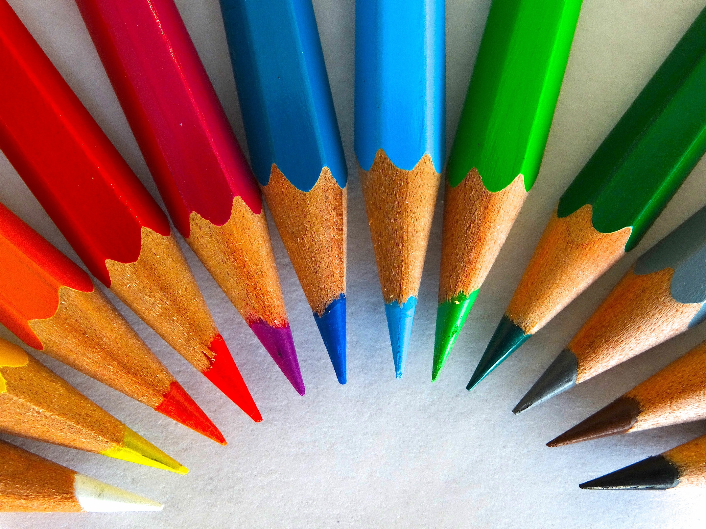

```{r setup, include=FALSE}
options(htmltools.dir.version = FALSE)

list.of.packages <- c("ggplot2", "yarrr")
new.packages <- list.of.packages[!(list.of.packages %in% installed.packages()[,"Package"])]
if(length(new.packages)) install.packages(new.packages)

rm("list.of.packages", "new.packages")

```

[🎶 The Pussycat Dolls - Don't Cha ft. Busta Rhymes](https://www.youtube.com/watch?v=YNSxNsr4wmA)

Image credit: [Giphy](https://giphy.com/gifs/nicole-scherzinger-pussycat-dolls-pcd-zHWESnDS3rJXG)

```{r, echo=FALSE, out.width = 700, fig.align='center'}

knitr::include_graphics("https://media.giphy.com/media/zHWESnDS3rJXG/giphy.gif")

```

---
# Colour matters!

```{r, echo=FALSE, out.width = 700, fig.align='center'}



```

---
class: inverse, center, middle

# Why?

---

# Colours can:

--

- .large[influence emotion, which can influence how people understand your data.]

--

- .large[connect to meaning. (Hot and cold? .red[**Red**] and .blue[**blue**].)]

--

- .large[show **more** or .gray[**less**] with intensity/brightness.]

--

- .large[look brighter when bigger/less bright when smaller (think] *paint chip* .large[vs] .extralarge[**wall**].large[).]

--
<br></br>

Good discussion in this [interview with Maureen Stone,](https://www.fastcompany.com/3062182/how-to-use-color-to-prove-your-point-from-a-data-viz-expert) a colour expert with Tableau.


---

# What's this talk for?

--

- .large[tips about what to think about when *picking* palettes]

--

- .large[showing some cool/useful palettes]

--

- .large[giving you the basics for making your own palettes]

--

# Assumptions I'm making

-- 

- you are somewhat familiar with `ggplot` and R in general

--

- you don't need heaps of technical info on hex codes and colour theory for this to be fun an useful

---
# What's in a colour?

--

.large[You're always going to need three pieces of information really understand making a colour in a computer.]

--

.large[But thankfully there are a couple different ways to approach this.]

--

.large[You'll usually see a colour written in one of 4 ways:]
- Just as a colour name "red" (has to be one R recognises)
- As a mix of **hue, saturation and lightness** (HSL)
- As a mix of redness, greenness and blueness (RGB)
- As 6 numbers with a # at the front eg. #ff0000 (Hex code)

[Useful](https://www.w3schools.com/colors/colors_picker.asp)
---
class: inverse, middle, center

# What do you need your colours to do?

---
class: middle, center

.large[Just look different from each other?]

--

.large[You want a **qualitative palette**.]

---

---
class: middle, center

.large[Show a range from more to less?]

--

.large[You want a **sequential palette**.]

---

---
class: middle, center

.large[Contrast around a specific point?]

--

.large[You want a **diverging palette**.]

--
<br>
<br>
<br>
.small[Thanks to [this Everyday analytics article](https://everydayanalytics.ca/2017/03/when-to-use-sequential-and-diverging-palettes.html) for helping my clarify my thinking on this one.]

---

# Pirate palette

<a href="https://cran.r-project.org/web/packages/yarrr/vignettes/piratepal.html" target="_blank"><button class="button">📦 `yarrr`</button></a>

```{r, fig.height = 5.5, fig.align='center'}
yarrr::piratepal(palette = "all")
```

---
# Pirate palette

<a href="https://cran.r-project.org/web/packages/yarrr/vignettes/piratepal.html" target="_blank"><button class="button">📦 `yarrr`</button></a>

```{r, eval=FALSE }
yarrr::piratepal(palette = "southpark", 
          trans = .5,
          plot.result = T)
```

---

```{r, fig.height = 8, fig.width = 9, fig.align='center', echo = FALSE}
yarrr::piratepal(palette = "southpark", 
          trans = .5,
          plot.result = T)
```

[Pirate pal vignette](https://cran.r-project.org/web/packages/yarrr/vignettes/piratepal.html)

---

https://edwinth.github.io/blog/paletti/
[ochRe](https://ropensci.org/blog/2017/11/21/ochre/) h/t @dicook
[Dutchmasters](https://edwinth.github.io/blog/dutch-masters/)
Ghibli h/t @jacquietran
Harry Potter  h/t @annafergusson
Wes Anderson
Pirate Palette

[Colour Space](http://colorspace.r-forge.r-project.org/articles/hcl_palettes.html)

Viridis
RColourBrewer
ggsci - Scientific Journal inspired palettes (Lancet, but also Tron Legacy)
R base colours
[Good examples of these three here](https://www.datanovia.com/en/blog/top-r-color-palettes-to-know-for-great-data-visualization/)

Greyscale in ggplot

sometime you use scale_colour_manual with the values, sometimes you use a special function

---
# Resources

[Good compilation of resources here](https://blog.prototypr.io/another-post-about-colours-for-data-visualisation-part-3-diy-palettes-bfc8c8bad72f)

[Datawrapper blog with resources too](https://blog.datawrapper.de/colorguide/), including Art Palette Experiment by Google, Movies

 Color Palette Generator by Steven DeGraeve can help make colour palette from a still
 
 Things to think about - which colour do you put next to eachother? [Visual blurring not good](https://datahero.com/blog/2013/08/08/why-color-matters-in-data-visualisation/)

---

class: center, middle

# Thanks!

Slides created via the R package [**xaringan**](https://github.com/yihui/xaringan).

The chakra comes from [remark.js](https://remarkjs.com), [**knitr**](http://yihui.name/knitr), and [R Markdown](https://rmarkdown.rstudio.com).
